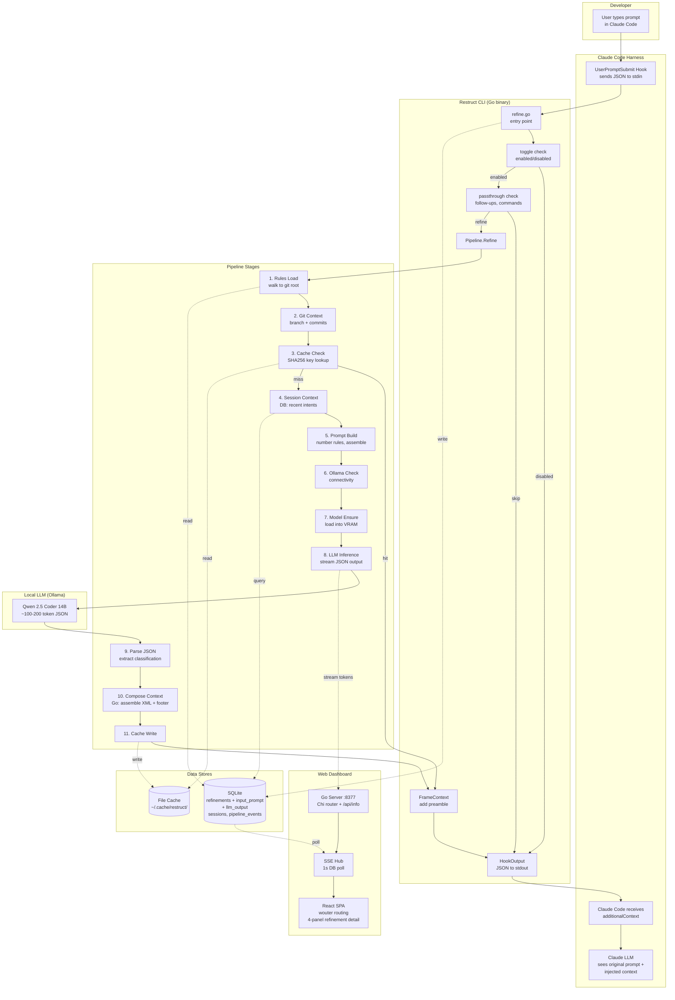
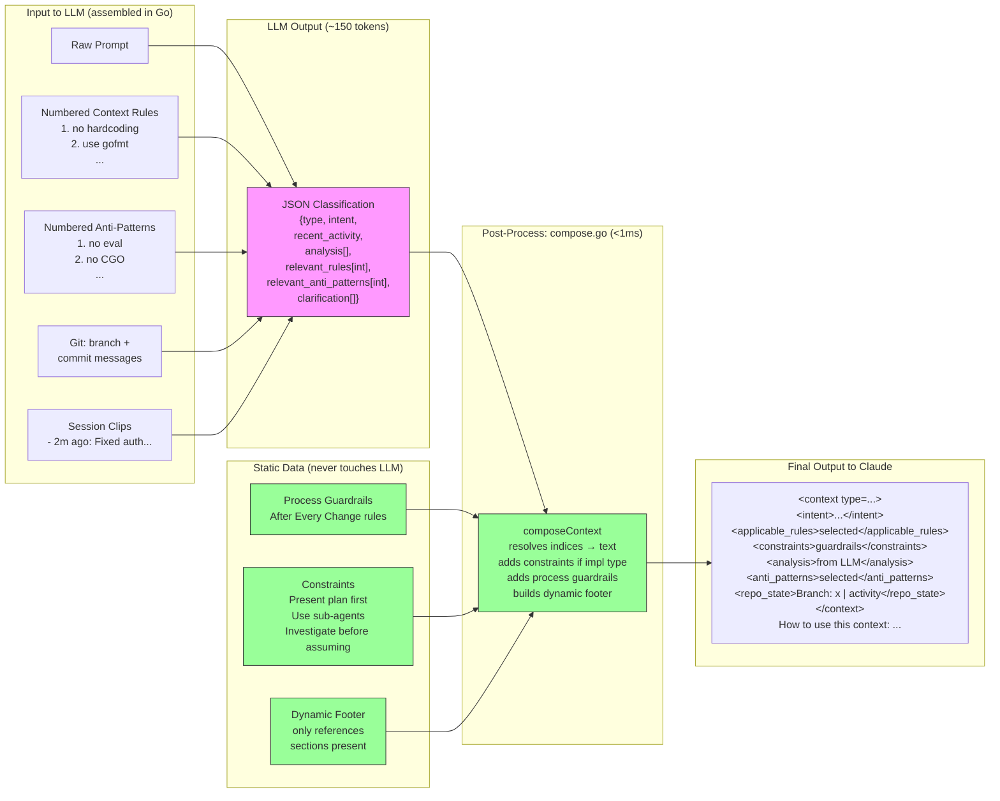
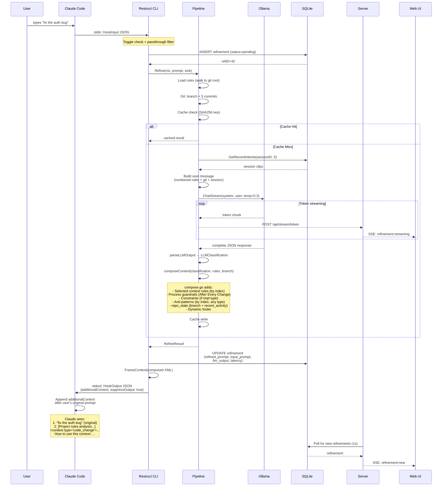
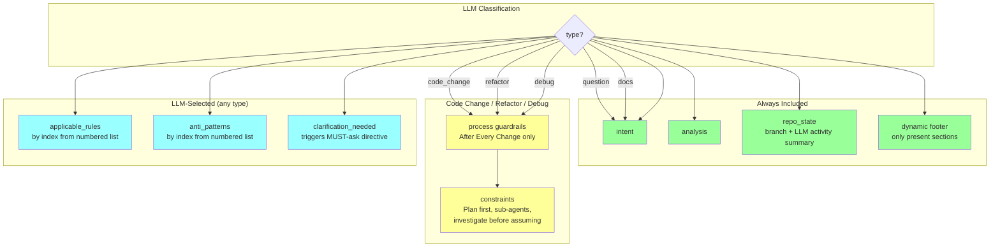
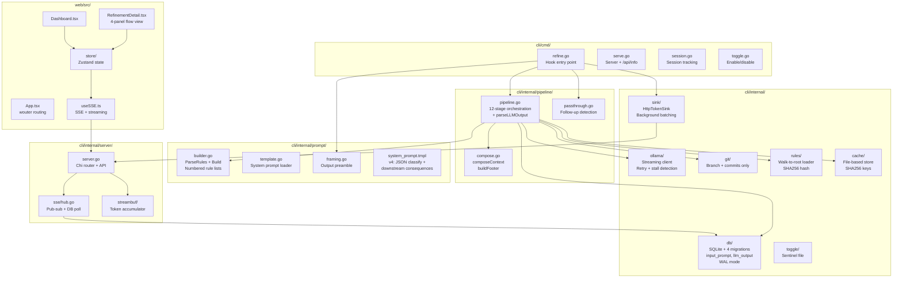

# Restruct Architecture

## System Overview



## Data Flow: What the LLM Actually Does



## Sequence: Single Prompt Lifecycle



## Request Type → Output Sections



## Component Map



## Web UI: Refinement Detail (4-Panel Flow)

```
┌─────────────────────────────────────────────────────────┐
│ 1. User Prompt                                          │
│ What the developer typed in Claude Code                 │
├─────────────────────────────────────────────────────────┤
│ 2. LLM Input                                           │
│ System prompt (v4 classification instructions)          │
│ + User message (numbered rules, git, session, prompt)   │
├─────────────────────────────────────────────────────────┤
│ 3. LLM Output                                          │
│ Raw JSON: {type, intent, recent_activity, analysis,     │
│   relevant_rules[int], relevant_anti_patterns[int],     │
│   clarification[]}                                      │
├─────────────────────────────────────────────────────────┤
│ 4. Final Context (additionalContext)                    │
│ Composed XML with resolved rules + static constraints   │
│ + dynamic footer                                        │
└─────────────────────────────────────────────────────────┘
```
